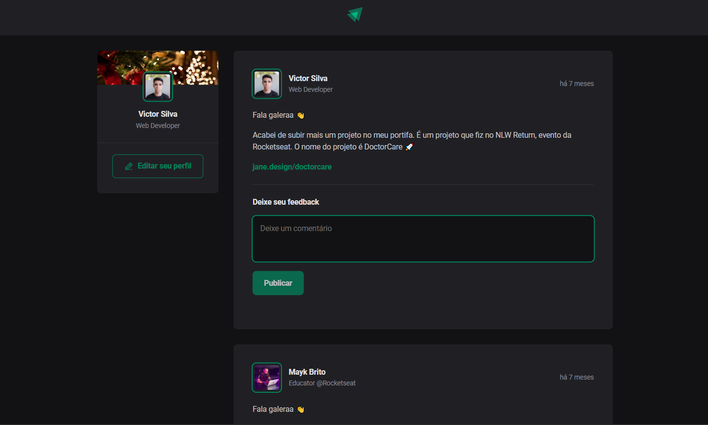

# ReactJS Fundamentals

In this project I learned the main concepts of the ReactJS Library. Here it was possible to learn how to use states and useEffects besides to create my own components in ReactJS using Typescript.

### Status

Finished 🚀

### Preview



### How to use

```sh
git clone https://github.com/vickttorugo/ignite-reactjs-fundamentals.git
```

```sh
cd ./ignite-reactjs-fundamentals && npm install
```

```sh
npm run dev
```

The application will run in `http://localhost:5173`

### Stack

- React
- vite
- Typescript
- date-fns
- phosphor-react

### Author

<div>


<sub><b>Victor Silva</b></sub>🚀
</div>